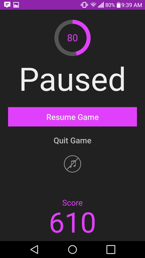
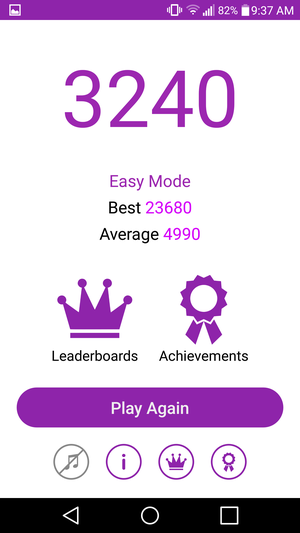

Variant Tap
===========

A fast-paced, arcade-style Android game. [Get it now on Google Play!](https://play.google.com/store/apps/details?id=ca.keal.varianttap)

Screenshots:

Note: this repository cannot be run as-is because the file app/src/main/res/values/ids.xml is
missing. This file contains sensitive Google Play Games IDs and thus cannot be included in a
possibly-public repository. To compile this repo, add your own GPGS IDs in ids.xml.

Google Play and the Google Play logo are trademarks of Google LLC.
